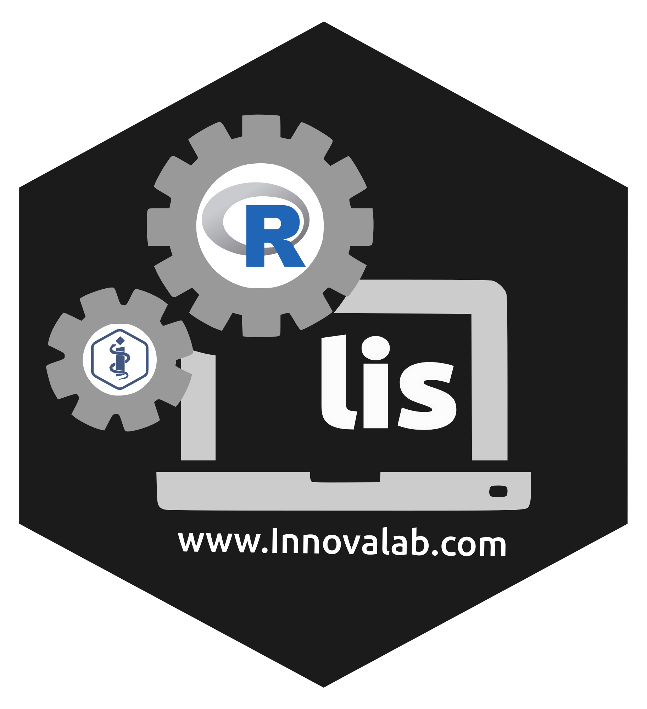

# **lis** 

<!-- badges: start -->
<table>
 

 
</table>

<!-- badges: end -->

Librería de funciones del laboratorio de Innovación en Salud

## Instalation

Type | Source | Command
---|---|---
Development | GitHub | `remotes::install_github("healthinnovation/lis")`

## Social medias

 
 

